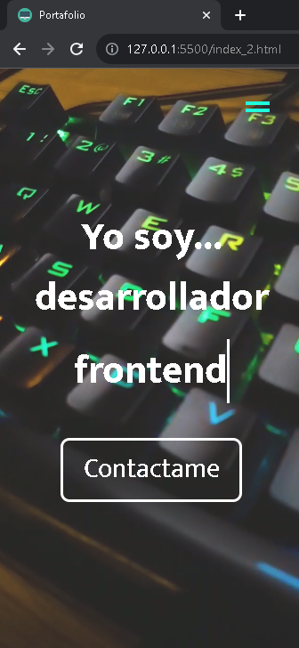
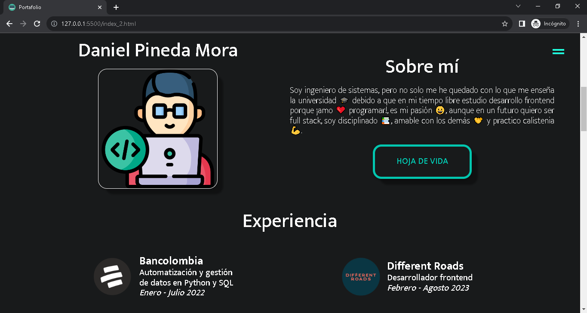
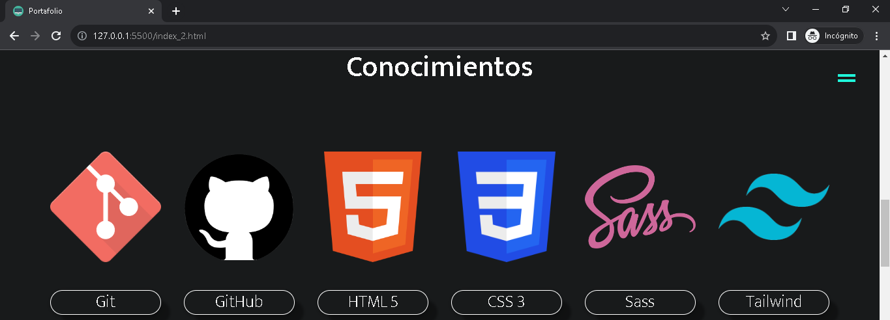
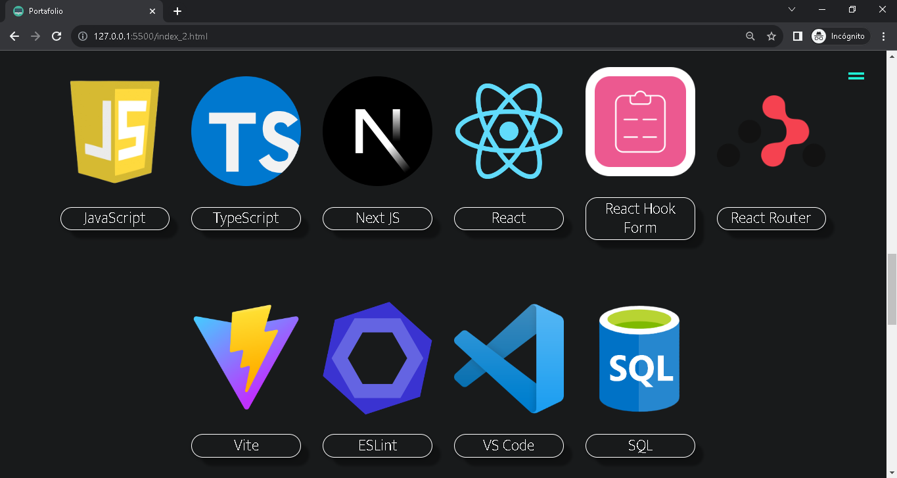
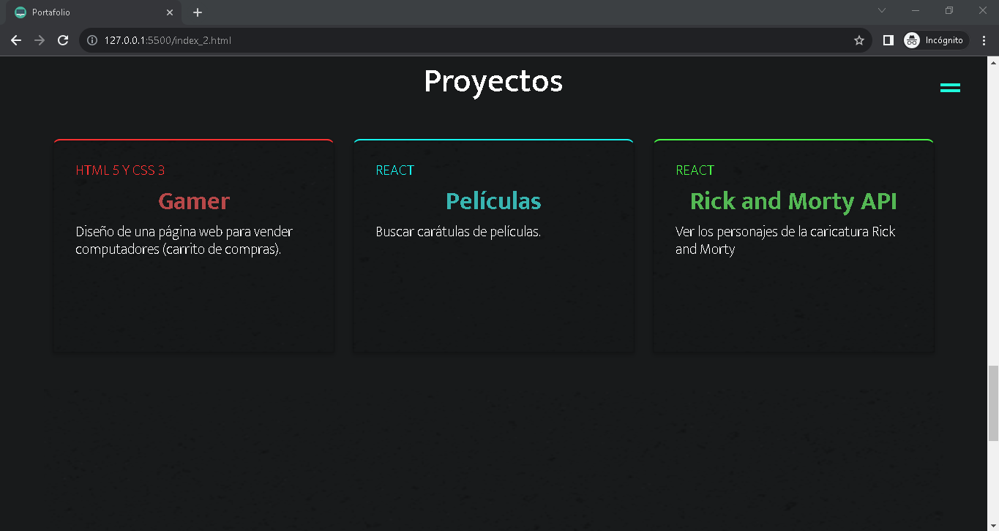
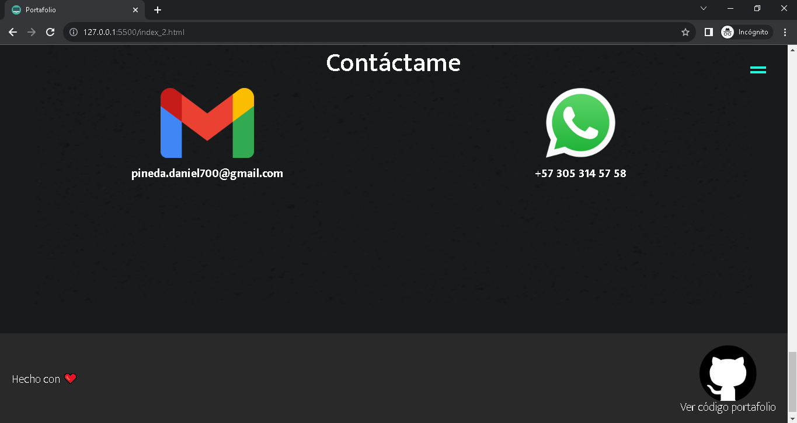
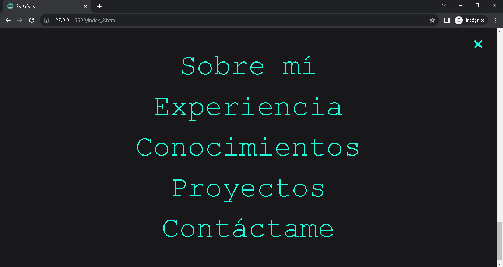

# **Mi Portafolio**

[**Ver página web en GitHub Pages**](https://danielpinedam.github.io/)
****
------------

------------

------------

------------

------------

------------

------------

------------

En index.html esta el HTML, CSS y JavaScript en un solo archivo minificado y usando Autoprefixer CSS, el index_2.html es el mismo código pero tiene comentarios y llama a los arhivos externos:
* De JavaScript
  * js/maquina_de_escribir.js
  * js/menu.js
* De CSS
  * css/style.css

Recursos:
* Portafolio inspirado en:
  * [Fazt Web](https://faztweb.com/)
  * Jacek Jeznach
    * [Pagina web](https://jacekjeznach.com/)
    * [GitHub](**https**://github.com/Almarex-Web-Dev/Jacek-portfolio-from-part-1-to-3)

* [Eliminar color de fondo azul cuando se hace click en los enlaces](https://stackoverflow.com/questions/21003535/anyway-to-prevent-the-blue-highlighting-of-elements-in-chrome-when-clicking-quic)

* [Texto Responsive usando Utopia Fluid Responsive Design](https://utopia.fyi/type/calculator?c=320,17,1.2,1500,20,1.333,8,1,&s=0.75|0.5|0.25,1.5|2|3|4|6,s-l)

* [Contenido multimedia (embebido) Responsive](https://www.youtube.com/watch?v=udGrXWeJp1Y&t=4090s)

* Menú desplegable de pantalla completa
  * [Free Frontend](https://freefrontend.com/css-fullscreen-menus/)
  * [Codepen](https://codepen.io/hexagoncircle/pen/OJLMgYY)

* Cerrar menu despues de darle click al enlace
  * [YouTube](https://youtu.be/KJbLiV6Y9sY)
  * [dev.to](https://dev.to/karataev/set-css-styles-with-javascript-3nl5)
  * [Stack Overflow](https://stackoverflow.com/questions/8206565/check-uncheck-checkbox-with-javascript)

* Video de fondo background-video
  * [YouTube Fazt Web](https://youtu.be/bwHxGzHjLTU)
  * [Mi código en GitHub](https://github.com/DanielPinedaM/background-video)
  * [Pexels Video para dispositivos moviles](https://www.pexels.com/es-es/video/teclado-con-luz-led-negro-1821832/)
  * [Pexels Video para dispositivos de escritorio](https://www.pexels.com/es-es/video/manos-teclear-teclado-informacion-5377274/)

* [CSS-Tricks Efecto de máquina de escribir](https://css-tricks.com/snippets/css/typewriter-effect/)

* Botones animados
  * [YouTube](https://youtu.be/c-4wFMGFuCg)
  * [uiverse.io](https://uiverse.io/detail/cssbuttons-io/stale-rattlesnake-87)

* [Imágenes de texturas para fondo](https://www.transparenttextures.com/)

* [Stack Overflow video Responsive](https://stackoverflow.com/questions/66824131/media-max-width-or-min-width-for-video)

* [Stack Overflow animación para cambiar el color del texto](https://stackoverflow.com/questions/16782498/looping-animation-of-text-color-change-using-css3)

* [Generador de enlaces de WhatsApp](https://vilmanunez.com/crear-enlace-whatsapp/)

* Enlace para enviar correo de Gmail
  * [En dispositivos moviles se abre la aplicacion de Gmail](https://stackoverflow.com/questions/4782068/can-i-set-subject-content-of-email-using-mailto)
  * [En dispositivos de escritorio se abre el navegador en una nueva pestaña de Gmail](https://stackoverflow.com/questions/15385207/how-to-change-href-attribute-using-javascript-after-opening-the-link-in-a-new-wi)

* [YouTube Fazt Web desplegar en GitHubPages usando npm gh-pages](https://youtu.be/G2FoSpsq3Rw)
